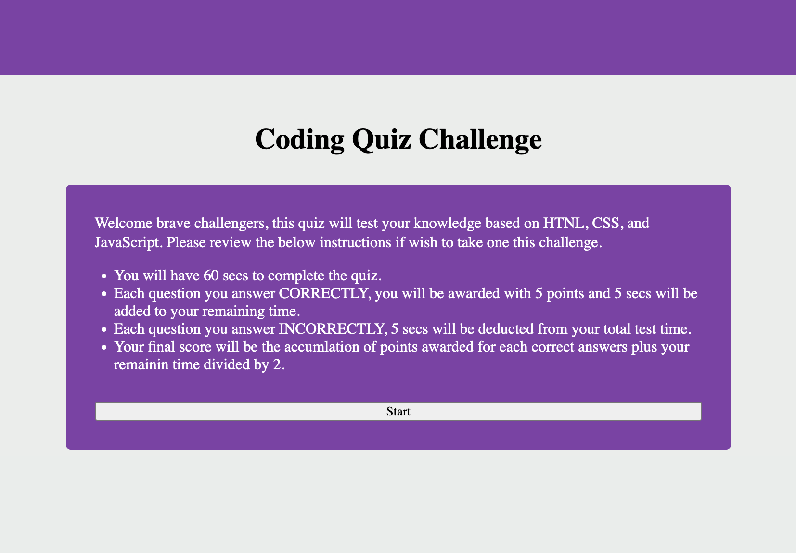
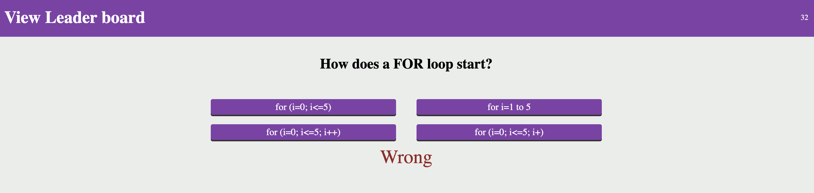
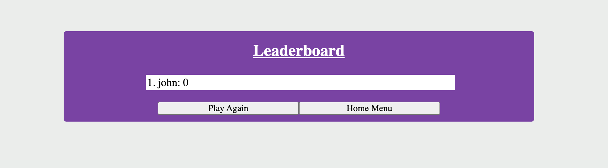

# code-quiz

## Purpose
This application is a coding multiple choice quiz related to Javascript. The player will have 60 secs to complete the quiz. Once the quiz is kicked off, every correct question will grant the user 5 points and will be granted 5 addtional secs to the initial 60 secs, and for every incorrect answer the player will lost 5 secs from their remaining time. Once the player have complete all the questions or run out of time, the final score will be displayed to the player. The play can then submit the his or her score to the leaderboard. The player will be be able to view how he or she rank on the leader board.

## Screenshots
Quiz home page with instruction about the quiz 

 Quiz will cycle through different questions and its potential answers for the user to select. The top right hand corner shows the remaining time the players has left. The user can view the Scoreborad any time by clicking on the View Scoreboard on the top left. Once click the player will forfite their turn. 

 Once the player have either answered all the questions or ran out of time. The player have the option to submit their score to the leaderboard. 

 Shows the player where he/she rank on the leaderboard. 

## Built With
* HTML
* CSS
* JavaScript

## Website
https://tonymengt.github.io/code-quiz/
